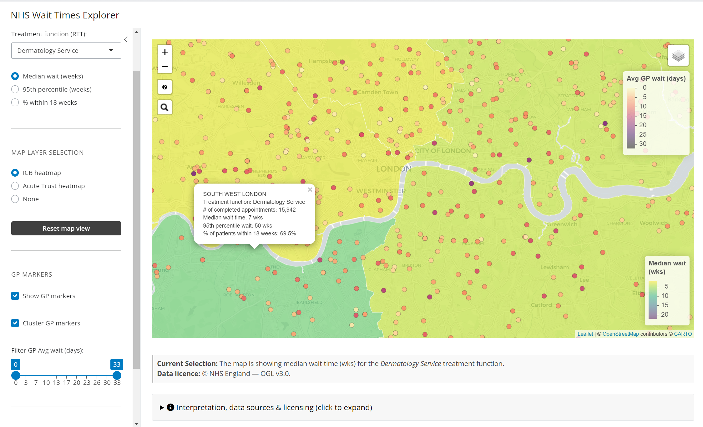

# NHS Wait Times Explorer
An R/Shiny project mapping non-acute GP appointment wait times and Consultant-led Referral To Treatment (RTT) waiting times across England.



## Quick Links:
**🚀 Live app:** https://n-garner.shinyapps.io/nhs-wait-times-explorer/ 

**🤓 Code & data pipeline (this page):** https://github.com/N-Garner/NHS-wait-times-explorer 

**📘 Documentation website:** https://n-garner.github.io/NHS-wait-times-explorer/

## Introduction

**The NHS Wait Times Explorer** is a Shiny app and reproducible R project that maps how long people wait to see a GP and to start elective (non‑admitted) hospital treatment across England. I built it because continuous access to care is critical for people living with chronic conditions. Delays at any step (getting a GP appointment, getting referred, starting treatment) can mean poorer outcomes in both the short term and long term. This tool helps patients, clinicians, and planners quickly spot where access is faster, so they can aim referrals or self‑registration toward organisations with shorter waits.

### Why this matters

- **Continuity of care:** Faster GP access supports ongoing management (meds reviews, monitoring) rather than crisis care.  
- **Referral efficiency:** Knowing which Trusts/ICBs clear pathways sooner can shorten the journey from first symptom to treatment.  
- **Transparency & equity:** Visualising waits highlights regional variation and can inform commissioning or patient choice discussions.  
- **Open, reusable workflow:** All code is in R, data come from public NHS sources under the Open Government Licence, and the pipeline is reproducible (via `{renv}`), so others can audit, extend, or repurpose it.

### What you can do with it

- Toggle between **ICB** and **Acute Trust** boundaries.  
- Colour by **Median wait**, **95th percentile**, or **% treated within 18 weeks** (with sensible palette direction).  
- Show/hide **~6000 GP practices**, filter by average wait (days), cluster markers, and search by name.  

Jump to the live app, browse the docs for methods and licensing, or clone the repo to run locally.

## How to run locally

```r
# 0) Clone the repo and open the project
renv::restore()               # install packages

# 1) Prepare the data (run once, or when you want to refresh)
source("scripts/load_and_transform.R")

# 2) Manually download Trust shapefile (mandatory):
#    https://www.eastsussexjsna.org.uk/resources/nhs-acute-hospital-trust-catchment-populations/
#    -> follow Box link -> download ZIP -> extract to Output_Data/2022Elective_FPTP_Full/

# 3) Launch the app
shiny::runApp("app")
```

Contains public sector information licensed under the [Open Government Licence v3.0](https://www.nationalarchives.gov.uk/doc/open-government-licence/version/3/).

